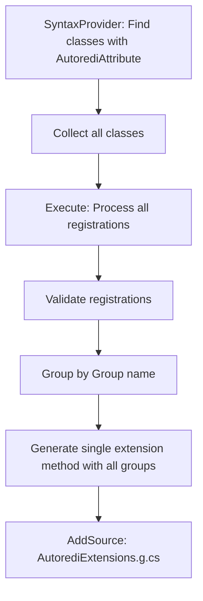
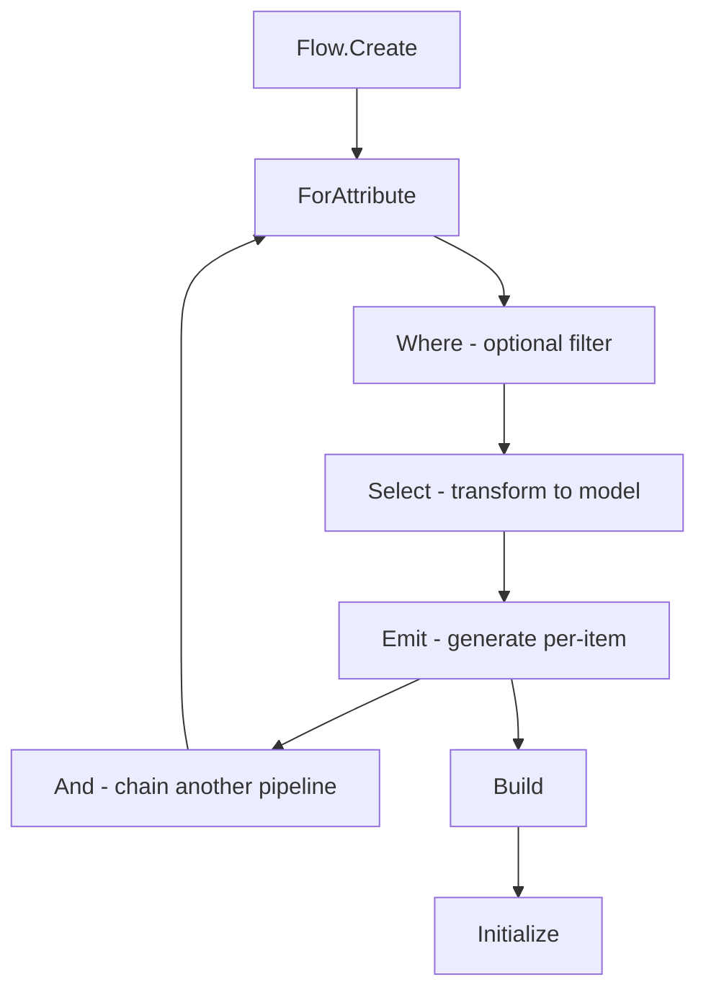

# Autoredi Rearchitecture Plan: Integration with Flowgen

## Executive Summary

This document outlines the plan to rearchitect Autoredi to use Flowgen as its underlying source generation framework. The primary challenge is bridging Flowgen's 1-to-1 pipeline model with Autoredi's requirement for N-to-1 aggregation (collecting multiple service registrations into a single extension method).

## Current State Analysis

### Autoredi's Current Architecture



**Key Characteristics:**
- Uses `CreateSyntaxProvider` to find candidate classes
- Uses `.Collect()` to aggregate all matching classes into an `ImmutableArray<ClassDeclarationSyntax>`
- Processes ALL registrations in a single `Execute` method
- Generates a SINGLE output file containing:
  - Main `AddAutorediServices()` method
  - Group-specific methods (`AddAutorediServicesFirebase()`, etc.)
- Handles cross-assembly references by scanning referenced assemblies

**Critical N-to-1 Pattern:**
```csharp
// Many inputs (individual service registrations)
var classDeclarations = context.SyntaxProvider
    .CreateSyntaxProvider(...)
    .Collect(); // <-- Aggregates N items

// One output (single extension method file)
context.RegisterSourceOutput(compilationAndClasses, 
    (spc, source) => Execute(source.Left, source.Right, spc));
```

### Flowgen's Current Architecture



**Key Characteristics:**
- Fluent, LINQ-like API
- Each pipeline processes items 1-to-1
- `Emit` is called once per matched item
- Multiple pipelines can be chained with `.And()`
- Each pipeline generates output independently

**Current Pipeline Pattern (1-to-1):**
```csharp
Flow.Create(context)
    .ForAttribute<MyModel>("MyAttribute")
    .Select((ctx, _) => new MyModel(ctx.Symbol.Name))
    .Emit((spc, model) => {
        // Called once PER matching item
        spc.AddSource($"{model.Name}.g.cs", code);
    })
    .Build()
    .Initialize(context);
```

## The N-to-1 Gap

### Problem Statement

Flowgen's current design generates **one output per input**. Autoredi requires **one output from many inputs** (aggregating all service registrations into a single extension method class).

### Current Flowgen Limitations

1. **No `.Collect()` equivalent**: Flowgen doesn't expose a way to aggregate all matched items before emission
2. **Per-item emission only**: The `Emit` action receives individual models, not collections
3. **No aggregation stage**: Missing a pipeline stage between `Select` and `Emit` that would allow collecting items

### Why This Matters for Autoredi

Autoredi generates code like this:

```csharp
public static class AutorediExtensions
{
    // Registers only the ungrouped services
    public static IServiceCollection AddAutorediServices(this IServiceCollection services)
    {
        services.AddSingleton<DefaultService>();
        return services;
    }

    // Aggregates ALL services into one method associated with this assembly
    public static IServiceCollection AddAutorediServicesAutorediTests(this IServiceCollection services)
    {
        // Calls the default helper and each group helper
        services.AddAutorediServices();
        services.AddAutorediServicesFirebase();
        services.AddAutorediServicesAccount();
        return services;
    }

    // Group method containing multiple registrations
    public static IServiceCollection AddAutorediServicesFirebase(this IServiceCollection services)
    {
        services.AddSingleton<FirebaseConfig>();
        services.AddTransient<FirebaseRepo>();
        services.AddSingleton<FirebaseLogger>();
        return services;
    }
    
    // ... more groups
}
```

This requires knowing about ALL registrations at emission time, not processing them individually.

## Proposed Solutions

### Option 1: Extend Flowgen with `.Collect()` and `.EmitAll()` (Recommended)

Add N-to-1 aggregation capabilities directly to Flowgen:

```csharp
// New API design for Flowgen
Flow.Create(context)
    .ForAttribute<ServiceRegistration>("Autoredi")
    .Select((ctx, _) => ExtractRegistration(ctx))
    .Collect()                                    // NEW: Aggregate all items
    .EmitAll((spc, registrations) => {           // NEW: Emit from collection
        // registrations is ImmutableArray<ServiceRegistration>
        var code = GenerateExtensionMethods(registrations);
        spc.AddSource("AutorediExtensions.g.cs", code);
    })
    .Build()
    .Initialize(context);
```

**Implementation in Flowgen:**

```csharp
// New PipelineCollect<TModel> stage
public sealed class PipelineCollect<TModel>
{
    private readonly IncrementalGeneratorInitializationContext? _context;
    private readonly FlowBuilder _builder;
    private readonly string _attributeName;
    private readonly bool _useMetadataName;
    private readonly Func<GeneratorAttributeSyntaxContext, CancellationToken, TModel>? _attrSelector;

    internal PipelineCollect(...)
    {
        // Store configuration
    }

    /// <summary>
    /// Emits source code from a collection of all aggregated models.
    /// </summary>
    public PipelineOutput<ImmutableArray<TModel>> EmitAll(
        Action<SourceProductionContext, ImmutableArray<TModel>> emitAction)
    {
        return new PipelineOutput<ImmutableArray<TModel>>(
            _context, _builder, 
            CollectAndTransform,  // Transform that aggregates
            _attributeName, _useMetadataName, 
            emitAction, 
            isImplementation: false);
    }

    private ImmutableArray<TModel> CollectAndTransform(
        IncrementalValuesProvider<TModel> provider,
        IncrementalGeneratorInitializationContext context)
    {
        // Use Roslyn's Collect() to aggregate
        var collected = provider.Collect();
        
        // Register source output with the collected array
        context.RegisterSourceOutput(collected, (spc, items) => {
            // This will be handled by EmitAll's action
        });
        
        return collected;
    }
}
```

**Pros:**
- Native Flowgen support for N-to-1 scenarios
- Consistent with existing fluent API
- Enables many other aggregation use cases
- Maintains incremental generation benefits

**Cons:**
- Requires modifying Flowgen
- More complex implementation

### Option 2: Hybrid Approach (Autoredi uses Flowgen + Raw Roslyn)

Keep the N-to-1 aggregation in raw Roslyn while using Flowgen for other features:

```csharp
[Generator]
public sealed class AutorediGenerator : IIncrementalGenerator
{
    public void Initialize(IncrementalGeneratorInitializationContext context)
    {
        // Use Flowgen for individual service extraction
        var registrations = Flow.Create(context)
            .ForAttribute<ServiceModel>("Autoredi")
            .Select((ctx, _) => ExtractService(ctx))
            .Build()
            .ToProvider(); // NEW: Expose the provider without registering output

        // Use raw Roslyn for aggregation
        var collected = registrations.Collect();
        
        context.RegisterSourceOutput(collected, (spc, services) => {
            GenerateExtensionMethods(spc, services);
        });
    }
}
```

**Required Flowgen Enhancement:**
Add ability to get the provider without registering output:

```csharp
public IncrementalValuesProvider<TModel> ToProvider()
{
    // Return the configured provider for external use
    return _provider;
}
```

**Pros:**
- Minimal changes to Flowgen
- Flexible for complex scenarios

**Cons:**
- Mixes two patterns (less elegant)
- Loses some of Flowgen's encapsulation benefits

### Option 3: Custom Aggregation Model in Autoredi

Use Flowgen's per-item emission but implement custom aggregation:

```csharp
[Generator]
public sealed class AutorediGenerator : IIncrementalGenerator
{
    // Static collection to accumulate registrations across emission calls
    private static readonly List<ServiceRegistration> _registrations = new();

    public void Initialize(IncrementalGeneratorInitializationContext context)
    {
        Flow.Create(context)
            .ForAttribute<ServiceModel>("Autoredi")
            .Select((ctx, _) => ExtractService(ctx))
            .Emit((spc, model) => {
                // Accumulate in static list
                _registrations.Add(model);
            })
            .WithPostInitialization(ctx => {
                // Generate final output after all items processed
                GenerateExtensionMethods(ctx, _registrations.ToImmutableArray());
                _registrations.Clear();
            })
            .Build()
            .Initialize(context);
    }
}
```

**Pros:**
- Works with current Flowgen
- No Flowgen modifications needed

**Cons:**
- Static state is problematic for incremental generation
- Race conditions possible
- Breaks incremental compilation model
- Not thread-safe

## Recommendation: Option 1 - Extend Flowgen

### Rationale

1. **Architectural Alignment**: N-to-1 is a common pattern in source generators (configuration aggregation, registration collections, etc.)
2. **API Consistency**: Extending Flowgen maintains the fluent API philosophy
3. **Reusability**: Other generators will benefit from `.Collect()` and `.EmitAll()`
4. **Performance**: Proper integration with Roslyn's incremental pipeline

### Implementation Plan for Flowgen Extensions

#### Phase 1: Add `.Collect()` Stage

```csharp
public sealed class PipelineCollect<TModel>
{
    private readonly IncrementalGeneratorInitializationContext? _context;
    private readonly FlowBuilder _builder;
    private readonly IncrementalValuesProvider<TModel> _provider;

    internal PipelineCollect(
        IncrementalGeneratorInitializationContext? context,
        FlowBuilder builder,
        IncrementalValuesProvider<TModel> provider)
    {
        _context = context;
        _builder = builder;
        _provider = provider;
    }

    /// <summary>
    /// Emits source code from a collection of all aggregated models.
    /// </summary>
    /// <param name="emitAction">Action receiving the full collection of models.</param>
    /// <returns>A PipelineOutput for chaining.</returns>
    public PipelineOutput<ImmutableArray<TModel>> EmitAll(
        Action<SourceProductionContext, ImmutableArray<TModel>> emitAction)
    {
        return new PipelineOutput<ImmutableArray<TModel>>(
            _context, _builder, _provider, emitAction, isCollect: true);
    }
}
```

#### Phase 2: Modify PipelineOutput for Collection Support

```csharp
public sealed class PipelineOutput<TModel>
{
    // ... existing fields ...
    private readonly bool _isCollect;
    private readonly IncrementalValuesProvider<TModel>? _provider;

    // Constructor for collection-based output
    internal PipelineOutput(
        IncrementalGeneratorInitializationContext? context,
        FlowBuilder builder,
        IncrementalValuesProvider<TModel> provider,
        Action<SourceProductionContext, TModel> emitAction,
        bool isCollect)
    {
        _builder = builder;
        _emitAction = emitAction;
        _isCollect = isCollect;
        _provider = provider;

        if (context.HasValue && isCollect)
        {
            RegisterCollectPipeline(context.Value, provider, emitAction);
        }
    }

    private void RegisterCollectPipeline(
        IncrementalGeneratorInitializationContext context,
        IncrementalValuesProvider<TModel> provider,
        Action<SourceProductionContext, TModel> emitAction)
    {
        _builder.AddPipeline(ctx =>
        {
            // For collection, TModel is actually ImmutableArray<TItem>
            var collected = provider.Collect();
            ctx.RegisterSourceOutput(collected, (spc, items) => 
            {
                emitAction(spc, items);
            });
        });
    }
}
```

#### Phase 3: Add Extension Methods to PipelineTransform

```csharp
public sealed class PipelineTransform<TModel>
{
    // ... existing methods ...

    /// <summary>
    /// Collects all models into an array before emission.
    /// </summary>
    /// <returns>A PipelineCollect for aggregated emission.</returns>
    public PipelineCollect<TModel> Collect()
    {
        // Create the provider and return collect stage
        var provider = CreateProvider();
        return new PipelineCollect<TModel>(_context, _builder, provider);
    }
}
```

## Autoredi Rearchitecture with Extended Flowgen

### New Autoredi Implementation

```csharp
[Generator]
public sealed class AutorediGenerator : IIncrementalGenerator
{
    public void Initialize(IncrementalGeneratorInitializationContext context)
    {
        Flow.Create(context)
            // Extract individual service registrations
            .ForAttributeWithMetadataName<ServiceRegistration>(
                "Autoredi.Attributes.AutorediAttribute")
            .Select((ctx, ct) => ExtractRegistration(ctx, ct))
            // Collect all registrations into one
            .Collect()
            // Generate single extension method file
            .EmitAll((spc, registrations) => GenerateExtensionMethods(spc, registrations))
            .Build()
            .Initialize(context);
    }

    private static ServiceRegistration ExtractRegistration(
        GeneratorAttributeSyntaxContext ctx, 
        CancellationToken ct)
    {
        // Extract service info from attribute
        var classSymbol = (INamedTypeSymbol)ctx.TargetSymbol;
        var attribute = ctx.Attributes[0];
        
        return new ServiceRegistration(
            ClassName: classSymbol.ToDisplayString(),
            Lifetime: (int)attribute.ConstructorArguments[0].Value!,
            InterfaceName: GetInterfaceName(attribute),
            ServiceKey: GetServiceKey(attribute),
            Group: GetGroup(attribute),
            Priority: GetPriority(attribute)
        );
    }

    private static void GenerateExtensionMethods(
        SourceProductionContext spc, 
        ImmutableArray<ServiceRegistration> registrations)
    {
        // Group registrations
        var grouped = registrations
            .GroupBy(r => r.Group ?? "Default")
            .ToDictionary(g => g.Key, g => g.ToList());

        // Generate code
        var code = new StringBuilder();
        code.AppendLine("// <auto-generated/>");
        code.AppendLine("using Microsoft.Extensions.DependencyInjection;");
        code.AppendLine();
        code.AppendLine("namespace Autoredi.Generated;");
        code.AppendLine();
        code.AppendLine("public static class AutorediExtensions");
        code.AppendLine("{");
        
        // Generate main method
        GenerateMainMethod(code, grouped.Keys);
        
        // Generate group methods
        foreach (var group in grouped)
        {
            GenerateGroupMethod(code, group.Key, group.Value);
        }
        
        code.AppendLine("}");

        spc.AddSource("AutorediExtensions.g.cs", code.ToString());
    }
}

public record ServiceRegistration(
    string ClassName,
    int Lifetime,
    string? InterfaceName,
    string? ServiceKey,
    string? Group,
    int Priority
);
```

### Benefits

1. **Cleaner Code**: ~50% reduction in boilerplate
2. **Type Safety**: Strongly-typed models instead of syntax manipulation
3. **Testability**: Models are easy to test
4. **Maintainability**: Fluent API is more readable
5. **Performance**: Still uses incremental generation

## Migration Steps

### Step 1: Extend Flowgen (in /usr/local/repo/Flowgen)

1. Add `PipelineCollect<TModel>` class
2. Add `Collect()` method to `PipelineTransform<TModel>`
3. Add `EmitAll()` method to `PipelineCollect<TModel>`
4. Update `PipelineOutput<TModel>` to handle collection
5. Add unit tests
6. Update documentation

### Step 2: Update Autoredi.Generators

1. Add Flowgen package reference
2. Create `ServiceRegistration` model
3. Rewrite `AutorediGenerator` using Flowgen fluent API
4. Port diagnostic validation logic
5. Update tests

### Step 3: Validation

1. All existing tests pass
2. Generated code is identical (or improved)
3. Performance benchmarks show no regression
4. Cross-assembly references work correctly

## Files to Modify

### Flowgen Changes
```
/usr/local/repo/Flowgen/src/Flowgen/
├── Flow.cs (add Collect() method, PipelineCollect class)
└── docs/README.md (document N-to-1 pattern)

/usr/local/repo/Flowgen/tests/Unit/Flowgen.Tests/
└── FlowTests.cs (add tests for Collect/EmitAll)
```

### Autoredi Changes
```
src/Autoredi.Generators/
├── Autoredi.Generators.csproj (add Flowgen reference)
├── AutorediGenerator.cs (rewrite with Flowgen)
├── Models/
│   └── ServiceRegistration.cs (new)
└── Extraction/
    └── ServiceRegistrationExtractor.cs (new)
```

## Success Criteria

- [ ] Flowgen supports `.Collect()` and `.EmitAll()` operations
- [ ] Autoredi uses Flowgen for all source generation
- [ ] All existing Autoredi tests pass without modification
- [ ] Generated code is functionally equivalent
- [ ] No performance regression in benchmarks
- [ ] Cross-assembly service discovery works correctly
- [ ] Grouped registration works correctly
- [ ] Diagnostic validation works correctly
