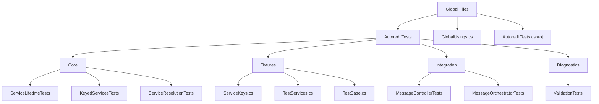

# Test Reorganization Plan

## Current State Analysis

### Existing Test Files
- `tests/Autoredi.Tests/LogServiceTests.cs` - Tests for ILogService (transient)
- `tests/Autoredi.Tests/MessageSenderTests.cs` - Tests for keyed IMessageSender
- `tests/Autoredi.Tests/ServicesTests.cs` - Tests for MessageController and MessageOrchestrator
- `tests/Autoredi.Tests/SettingsTests.cs` - Tests for Settings singleton
- `tests/Autoredi.Tests/Helpers.cs` - Test fixtures and implementations
- `tests/Autoredi.Tests/GlobalUsings.cs` - Global using directives
- `tests/Autoredi.Tests/Autoredi.Tests.csproj` - Project configuration

### Issues Identified
1. **Flat Structure** - All tests in root folder, no logical organization
2. **Redundant Setup** - Each test class duplicates service provider configuration
3. **Mixed Concerns** - Test fixtures in same folder as actual tests
4. **Missing Coverage** - No tests for Scoped services, cross-project registration, or diagnostics
5. **Naming Inconsistencies** - Some tests don't follow BDD naming convention

## Proposed Folder Structure

```
tests/Autoredi.Tests/
├── Autoredi.Tests.csproj
├── GlobalUsings.cs
├── Core/                          # Core functionality tests
│   ├── ServiceLifetimeTests.cs    # Singleton, Scoped, Transient
│   ├── KeyedServicesTests.cs      # Keyed service registration
│   └── ServiceResolutionTests.cs  # Basic service resolution
├── Fixtures/                      # Test fixtures and shared code
│   ├── ServiceKeys.cs             # Constants for service keys
│   ├── TestServices.cs            # Service implementations for testing
│   └── TestBase.cs                # Base class with common setup
├── Integration/                   # Integration tests
│   ├── MessageControllerTests.cs
│   └── MessageOrchestratorTests.cs
└── Diagnostics/                   # Error and edge case tests
    └── ValidationTests.cs         # Attribute validation, duplicate registration
```

## Detailed Reorganization Steps

### Phase 1: Create Folder Structure
1. Create `Core/` folder for fundamental service registration tests
2. Create `Fixtures/` folder for test utilities and base classes
3. Create `Integration/` folder for complex service interaction tests
4. Create `Diagnostics/` folder for error scenarios

### Phase 2: Move and Refactor Fixtures
1. Move `ServiceKeys` to `Fixtures/ServiceKeys.cs`
2. Move service implementations to `Fixtures/TestServices.cs`
3. Create `TestBase.cs` with shared service provider setup
4. Create `AutorediTestAttribute.cs` for common test patterns

### Phase 3: Create Core Tests
**ServiceLifetimeTests.cs** - Cover all three lifetimes:
- Singleton: Same instance on multiple resolutions
- Scoped: Same instance within scope, different across scopes
- Transient: Different instance on each resolution
- Mixed lifetimes in same container

**KeyedServicesTests.cs** - Cover keyed registrations:
- Valid key returns correct implementation
- Invalid key returns null
- Multiple keys for same interface
- Keyed service behavior verification

**ServiceResolutionTests.cs** - Cover basic resolution:
- Interface to implementation mapping
- Concrete type registration
- Multiple service resolutions

### Phase 4: Create Integration Tests
**MessageControllerTests.cs**:
- Controller receives correct service via constructor injection
- Controller method calls underlying service
- Error handling in controller

**MessageOrchestratorTests.cs**:
- Orchestrator resolves correct keyed service
- Orchestrator handles invalid keys
- Orchestrator delegates to correct sender

### Phase 5: Create Diagnostics Tests
**ValidationTests.cs**:
- Duplicate class registration errors
- Duplicate keyed registration errors
- Missing key for multiple interface implementations
- Invalid lifetime values
- Invalid interface type validation

### Phase 6: Add Missing Use-Cases
Based on generator code analysis:
- [ ] Cross-project assembly reference tests
- [ ] Circular dependency detection
- [ ] Interface without explicit implementation
- [ ] Self-registration (class without interface)
- [ ] Attribute parameter validation (3 parameters)
- [ ] Mixed lifetime scenarios in single container

## Test Naming Convention (BDD Style)

Following TUnit skill guidelines: `Action_ExpectedResult_Condition`

### Examples:
- `RegisterSingletonService_ReturnsSameInstance_OnMultipleResolutions`
- `ResolveKeyedService_ReturnsCorrectImplementation_WhenValidKeyProvided`
- `RegisterScopedService_ReturnsSameInstance_WithinSingleScope`
- `ResolveService_ThrowsException_WhenInvalidLifetimeProvided`

## Mermaid Diagram: Test Organization



## Implementation Priority

### High Priority (Core Functionality)
1. ServiceLifetime tests (all three lifetimes)
2. Keyed services tests
3. Basic resolution tests

### Medium Priority (Integration)
4. Message controller tests
5. Message orchestrator tests

### Low Priority (Edge Cases)
6. Diagnostics and validation tests
7. Cross-project tests

## Files to Create/Modify

### New Files:
- `tests/Autoredi.Tests/Core/ServiceLifetimeTests.cs`
- `tests/Autoredi.Tests/Core/KeyedServicesTests.cs`
- `tests/Autoredi.Tests/Core/ServiceResolutionTests.cs`
- `tests/Autoredi.Tests/Fixtures/ServiceKeys.cs`
- `tests/Autoredi.Tests/Fixtures/TestServices.cs`
- `tests/Autoredi.Tests/Fixtures/TestBase.cs`
- `tests/Autoredi.Tests/Integration/MessageControllerTests.cs`
- `tests/Autoredi.Tests/Integration/MessageOrchestratorTests.cs`
- `tests/Autoredi.Tests/Diagnostics/ValidationTests.cs`

### Files to Remove:
- `tests/Autoredi.Tests/LogServiceTests.cs` (merged into ServiceLifetimeTests)
- `tests/Autoredi.Tests/MessageSenderTests.cs` (merged into KeyedServicesTests)
- `tests/Autoredi.Tests/ServicesTests.cs` (merged into Integration tests)
- `tests/Autoredi.Tests/SettingsTests.cs` (merged into ServiceLifetimeTests)
- `tests/Autoredi.Tests/Helpers.cs` (replaced by Fixtures folder)

### Files to Update:
- `tests/Autoredi.Tests/GlobalUsings.cs` (update namespaces)
- `tests/Autoredi.Tests/Autoredi.Tests.csproj` (no changes needed)

## Success Criteria
1. All tests follow BDD naming convention
2. No duplicate test code or setup
3. Clear folder organization by feature
4. Comprehensive coverage of all Autoredi features
5. All existing tests pass after reorganization
6. New missing use-cases added for complete coverage